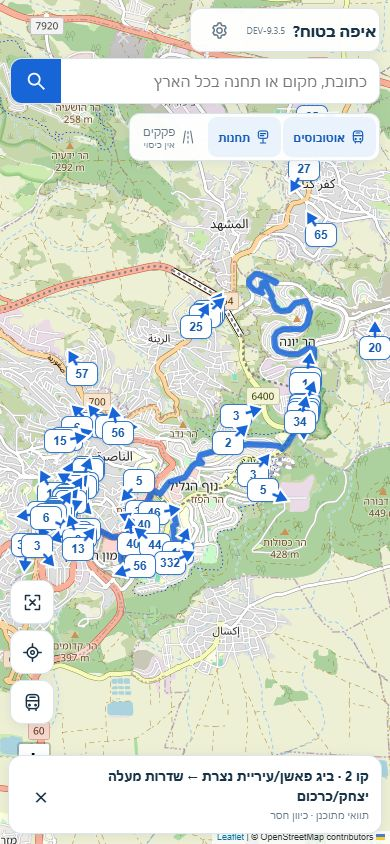

# DEV-9.3.5

20s visible-page polling follows observed source latency; no overlapping periodic requests, original clocks and expiry unchanged. Exact-code CI and canonical public desktop/phone proof pending.

Waze municipal source re-probed read-only at 2026-10-10T08:34:09.962Z: HTTP 200 with numeric segments and geometries, but updateDate is 2026-10-10T11:33:03.489Z. No manual 3h correction; no activated traffic and no nationwide partner approval. Original response retained in DEV-9.3.5-waze-probe.json. WORK read-only. TomTom connected Freemium, Israel coverage unavailable. Provider ETA remains unchanged.

Exact code 0e1c9891745e47a1bbcb60cc00afef193dc2fd3b; CI 38038633692 passed. DEV-only deployment dpl_J4u1NunXKUMuZgHaNDmGMF68n5wQ created following successful CI. Public verification pending.

## Canonical public verification passed

Run 38038777718 on 06176660a3f25e1d18470aec06db6c17472c59a7 passed verify and public-dev at 2026-10-10T08:43:04Z. Public runtime/version/branch and GTFS confirmed. Real address → station/region → source → vehicle marker → details → route witnessed on desktop and phone. Real Haifa 1 desktop / 10 phone; Nazareth 9 desktop / 72 phone (different viewports/times). Stop 23014 returned zero actual forecasts; no positive live forecast claimed for that stop. Route 10א has 693 real GTFS points.

Actual traffic status is connected=true, available=false, coverage-unavailable, with no rendered traffic images or invented active legend. Positive traffic pixels were NOT observed. Product remains blocked for actual traffic and weighted arrival estimates.

Synthetic fixtures independently passed delayed refresh during pan, partial data, 503 retention, clock expiry, operator identity, number-only marker/large source arrow, blank tiles, 429, 503 and future clocks. Synthetic colored PNGs are never proof of actual traffic.

Artifact 11664394705 holds real public and explicitly named synthetic screenshots; sha256:71536d8326a1e8b87d7c7f4b21a08a557085a7b8f0dfb8c94a4923a5dd9c0eb7.

## Additional actual phone proof

Phone 390×844, real operator 6 / vehicle 8125484 / route 17685 / trip 150351758, public line 2; source report 08:40:42Z, snapshot 08:41:00Z, source response clock absent, reported speed 36 km/h unchanged. Destination displayed as route destination, not guessed trip destination. Source expanded and planned route opened in actual UI. Route overview showed 65 recent source vehicles. This is an actual public browser screenshot, not a fixture.

JPEG sha256:12fb08af1baeccaa8feb6b18edeb44569580110796fe08cd35c54e404ad3e594; 91243 bytes. Source identity and provider clocks in JSON companion; municipal Waze original response stored separately. DEV-only changes, no other branch merge or mutation.
